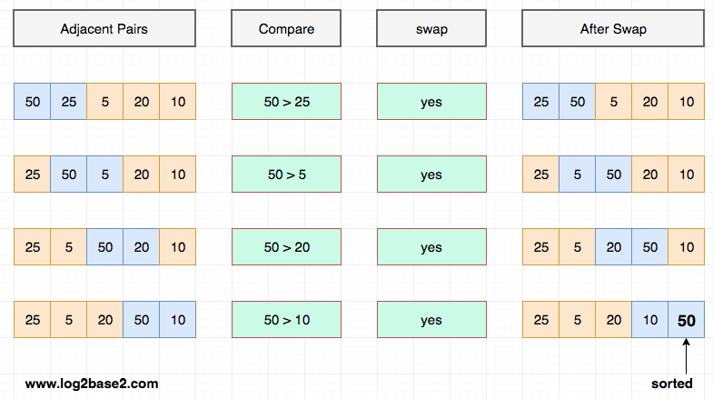

# What is bubble sort 

- 1. In bubble sort, each pair of adjacent elements are compared and the elements are swapped if they are not follow the ordering rule.

# Example
- Let's take an array of 5 elements.

  1. int arr[5] = {50, 25, 5, 20, 10}

### Step 1

<pre> We can notice that one element has been sorted after the above process.

In general, to sort N element using bubble sort, we need to do the same process N-1 times.

From next iteration onwards, we can skip the sorted elements. i.e. 50 </pre>

### Step 2

### Step 3

### Step 4

## ended the step
# Bubble short is majorly used where -
- 1. complexity does not matter
- 2. simple and shortcode is preferred